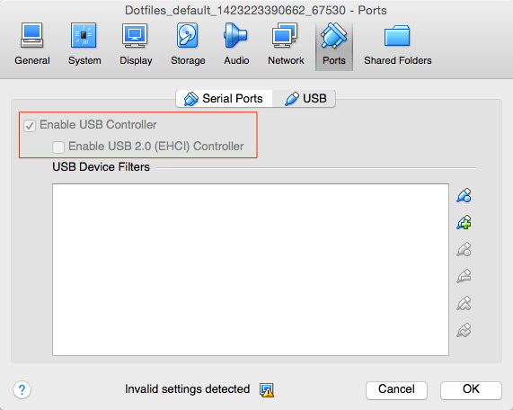

# Yosemite Test VM Setup

- disable USB 2.0
    - open virtualbox
    - vm settings
    - ports
    - usb
    - second checkbox
    - 

- setup VNC
    - ssh into the machine
    - `sudo /System/Library/CoreServices/RemoteManagement/ARDAgent.app/Contents/Resources/kickstart -activate -configure -access -off -restart -agent -privs -all -allowAccessFor -allUsers`
